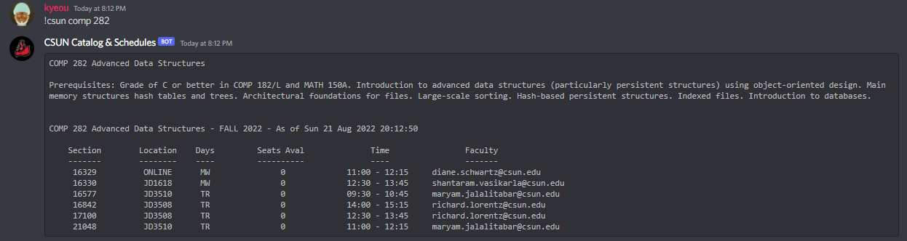
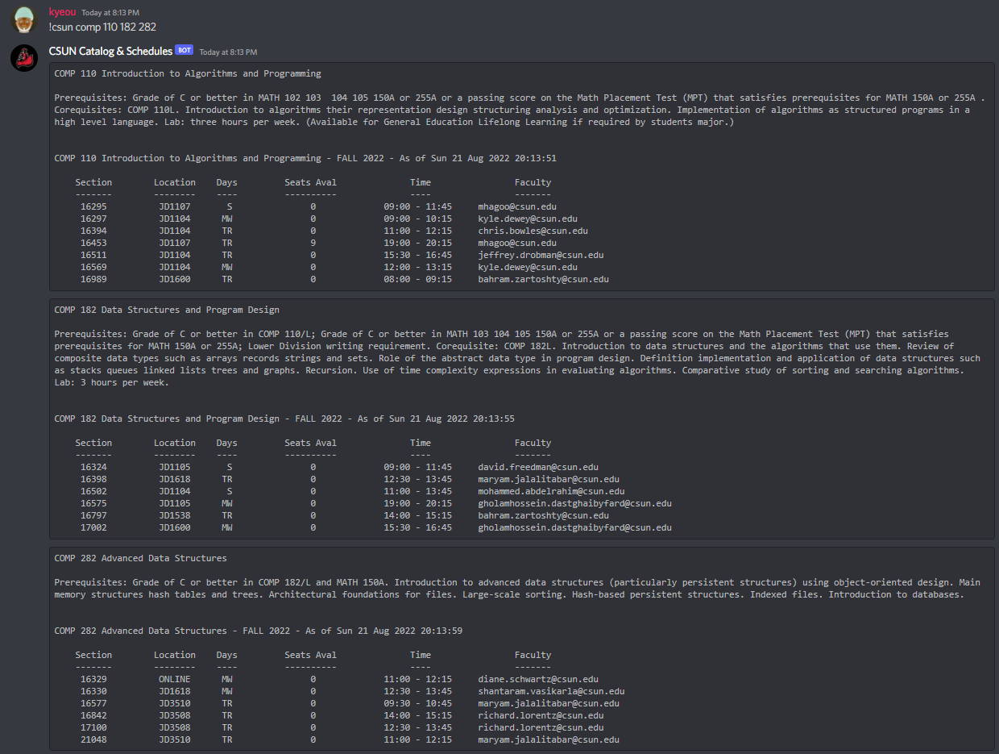
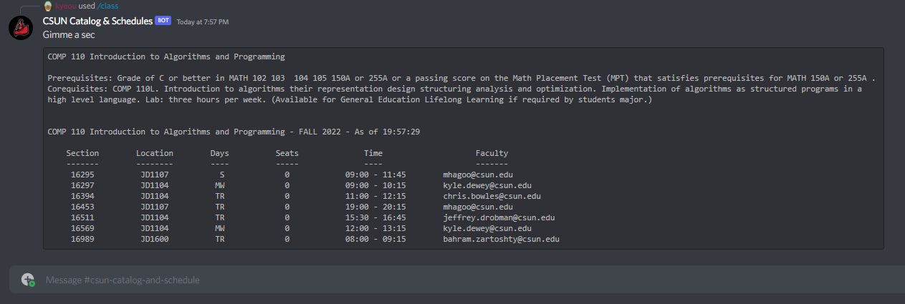
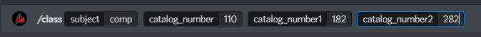
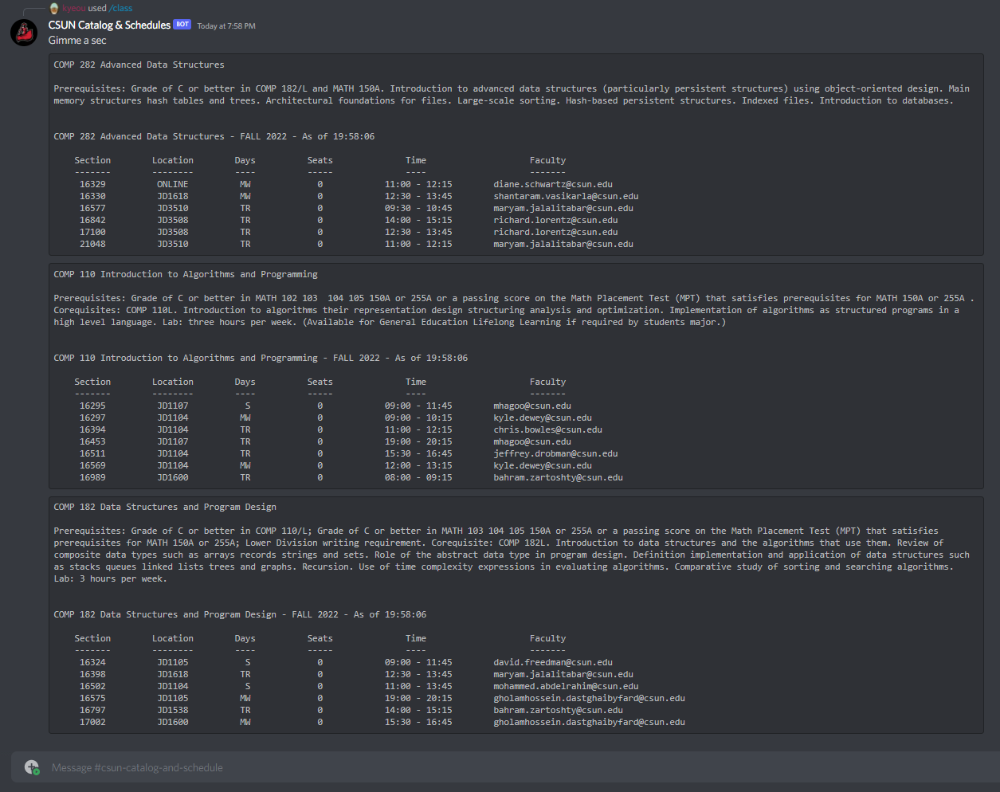
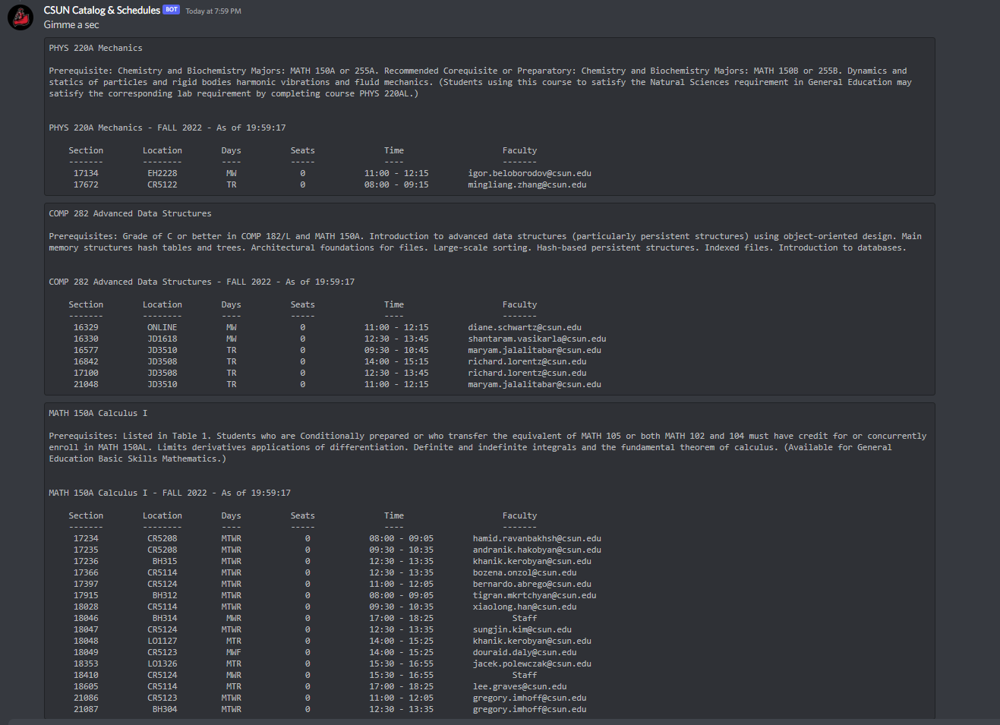
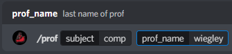
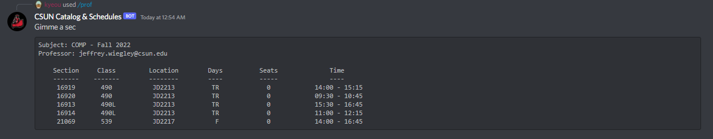
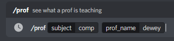
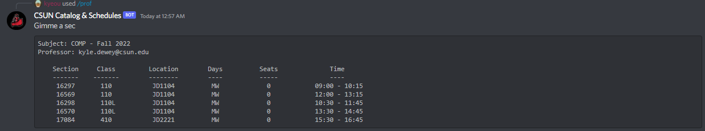

How to run:\
python show_schedules.py Semester Year SubjectCode\
Example:\
python show_schedules.py Fall 2022 COMP

How to run:\
python show_classes.py SubjectCode\
Example:\
python show_classes.py comp

Discord Bot Available:\
https://discord.com/api/oauth2/authorize?client_id=1001804710744948756&permissions=36507290688&scope=bot \
Help Command: !csun help or /help

The are 2 different ways the bot can be called, as it is implemented in 2 languages.

# Python Commands 

Single Class, Single Subject

Multiple Classes, Single Subject

Multiple Classes, Multiple Subjects was not implemented in the Python version

# Javascript Commands 

## Example 1: Single Class, Single Subject

## Example 2: Multiple Classes, Single Subject

## Example 3: Multiple Classes, Multiple Subjects

## The default semester is Fall 2022. 
### For other semesters append to end, subject YY, last 2 digits of year

Same input scheme for single subject input.

## Professor Search. 
### Search for a professor and the classes they are teaching.

